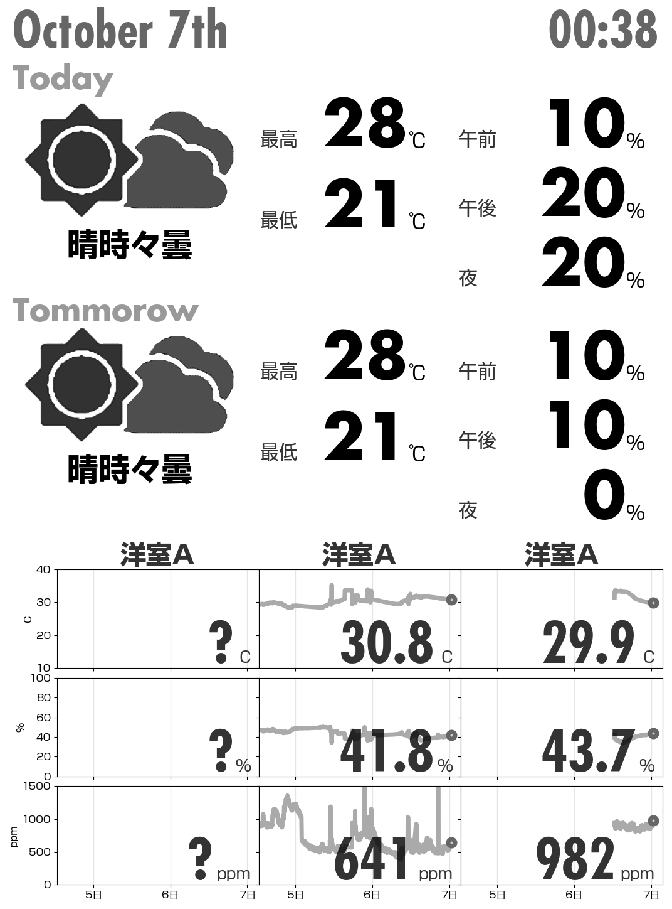

# Kindle weather panel

## 概要

Kindle に，SSH ログインして下記の情報を表示するためのスクリプトです．

-   天気予報
-   各種センサーの情報

表示サンプルは下記になります．

## 仕組み

大きく次の処理を行います．

-   Yahoo から天気予報の情報を取得
-   Influx DB からセンサー情報を取得
-   センサ情報を Matplotlib で描画
-   Kindle に SSH ログインして画像を描画

動かすための設定は，config.yaml に記述します．サンプルを config.example.yaml として登録してありますので参考にしてください．

Influx DB からセンサー情報を取得する部分( sensor_data.py の fetch_data )はお手元の環境に合わせて修正が必要かもしれません．

## ちょっと頑張った点

天気予報のアイコンを表示する部分だけ割と試行錯誤しています．Yahoo のアイコンをそのまま表示すると小さすぎるので，あまり破綻がないように上手いこと拡大処理してます．
